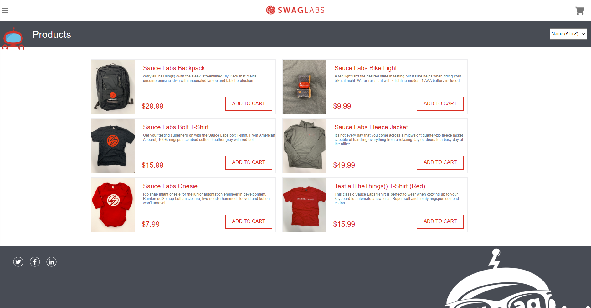

# Sauce Labs E-Commerce Testing Project

This project demonstrates automated testing of an e-commerce website using **Java**, **Selenium**, and **TestNG**. It focuses on verifying various features, including navigating through product pages, adding items to the shopping cart, and completing the checkout process.

The tests are implemented with **Object-Oriented Programming** principles, ensuring modularity, reusability, and clarity.

## Features Tested

- **Product Selection**: Clicking on items and adding them to the shopping cart.
- **Shopping Cart Functionality**:
  - Verifying added items.
  - Modifying quantities.
  - Removing items.
- **Checkout Process**:
  - Completing purchases.
  - Handling edge cases during checkout.
- **Error Handling**: Testing invalid scenarios such as incomplete forms or invalid data.
- **Navigation**: Ensuring smooth transitions between pages.

## Technologies Used

- **Java**: Core language for implementing tests.
- **Selenium WebDriver**: For browser automation.
- **TestNG**: Test framework for managing test execution.
- **Maven**: For dependency management and build automation.
- **CI/CD Integration**: Configured with **Docker** and **Jenkins** for continuous testing.

## How to Run the Tests

1. **Clone the Repository**:
   ```bash
   git clone https://github.com/ArielBrdah/sauce-labs-tests.git
   cd sauce-labs-tests
   ```
2. **Set Up Dependencies**:
Ensure you have Maven installed. Run the following command to install dependencies:
```bash
mvn clean install
```
3. **Run Tests**:
Execute all tests using TestNG:
```bash
mvn test
```
4. **Generate Reports**:
After running the tests, generate reports using Allure:

```bash
allure serve target/allure-results
```

## Highlights of the Project
- **Comprehensive Coverage**: Tests include both happy paths and edge cases.
- **Scalable Design**: Object-Oriented approach allows for easy addition of new tests.
- **Detailed Reports**: Integrated with Allure for rich, interactive test reports.
- **Cross-Browser Testing**: Supports multiple browsers to ensure compatibility.

## Future Enhancements
- Add support for additional payment methods.
- Expand coverage for advanced filters and sorting features.
- Implement performance testing for key functionalities.

## Contributions
Feel free to contribute by opening issues or submitting pull requests.

## License
This project is licensed under the MIT License. See the LICENSE file for details.
